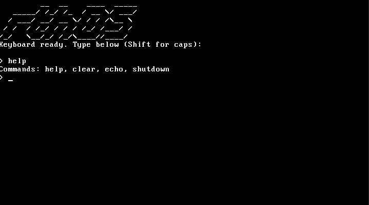

# Hobby Operating System to run PONG(C, x86 Assembly)
- This project is a hobby game-oriented OS capable of running a custom implemetation of PONG without relying on any external operating system.
- The system is being developed incrementally, starting in text mode to stabilize hardware interaction before introducing graphical complexity.



---

# Current State
- Executes a custom bootloader
- Switches to 32-bit protected mode
- Initializes VGA text-mode output (written to memory at 0xB8000)
- Initializes a PS/2 keyboard driver (polling-based)
- Displays a terminal interface with a shell prompt
- Supports a minimal interactive shell.
- The kernel currently runs entirely in text mode.

---

# Implemented Features

## Boot & Architecture

- Custom bootloader written in x86 assembly
- 32-bit protected-mode kernel
- Cross-compiled using an i686-elf GCC toolchain
- Bootable ISO image tested with QEMU

## Drivers

### VGA text-mode driver with:
- Character output
- Line wrapping
- Screen clearing
- Scrolling support

### PS/2 keyboard driver using controller polling
- Backspace handling
- Input buffering

## Terminal & Shell

- Interactive terminal interface
- Input buffer with length tracking
- Backspace editing support

### Built-in commands:

- help
- clear
- echo
- shutdown (QEMU ACPI poweroff: port I/O 0x604)

---

# Shell Architecture
- Commands will later be mapped to handler functions via a structured command table, allowing scalable and modular command extension.

## Architecture Overview

```
Bootloader (Assembly)
↓
Switch to Protected Mode
↓
Kernel (C)
├── VGA Driver
├── PS/2 Keyboard Driver (Polling)
├── Terminal Interface
└── Shell Command Dispatcher (later)
```

---

# Development Environment

- Cross-Compiler :The project uses a freestanding cross-compiler toolchain targeting i686-elf.
- [OSDev Wiki: GCC Cross-Compiler](https://wiki.osdev.org/GCC_Cross-Compiler)

---

# Primary references:

- [Interrupts – OSDev Wiki](https://wiki.osdev.org/Interrupts)
- [PS/2 Keyboard – OSDev Wiki](https://wiki.osdev.org/PS/2_Keyboard)
- [The Little Book about OS Development](https://littleosbook.github.io/)
- [Creating a Shell](https://wiki.osdev.org/Creating_A_Shell)

- Emulator: Tested primarily using QEMU (i386)
---

# Build & Run

- Build: `make`
- Run: `qemu-system-i386 -cdrom os.iso`  OR `make run`

---


# Goals

## Short-Term
- Transition keyboard driver from polling to IRQ-based handling
- Implement PIT timer support
- Improve shell command parsing and modularization

## Mid-Term
- Switch from text mode to a graphics mode (VGA or VESA)
- Implement a basic framebuffer abstraction
- Develop game loop timing infrastructure

## Long-Term
- Implement PONG entirely within the kernel environment
- Add minimal file system abstraction
- Explore basic task or module separation

## This project is primarily an exploration of:
- direct hardware interaction via port I/O and memory-mapped VGA
- interrupt handling
- freestanding C development
- validation under QEMU and x86 boot media

It is intentionally built without relying on external OS libraries or hosted runtime environments.

---

# Status
The project is in the early kernel phase and focused on building stable infrastructure before implementing graphical game logic.
