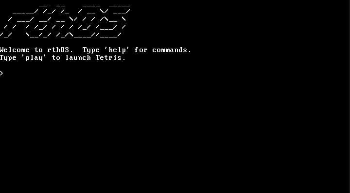
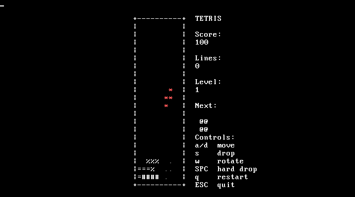

# Hobby Operating System to run Tetris (C, x86 Assembly)
- This project is a hobby game-oriented OS capable of running custom games without relying on any external operating system.
- The system is being developed incrementally, starting in text mode to stabilize hardware interaction before introducing graphical complexity.





---
# Current State
- Executes a custom bootloader
- Switches to 32-bit protected mode
- Initializes VGA text-mode output (written to memory at 0xB8000)
- Initializes a PS/2 keyboard driver (polling-based)
- Displays a terminal interface with a shell prompt
- Supports a minimal interactive shell
- **Features a fully playable ASCII Tetris game launched from the shell**
- The kernel currently runs entirely in text mode
---
# Implemented Features
## Boot & Architecture
- Custom bootloader written in x86 assembly
- 32-bit protected-mode kernel
- Cross-compiled using an i686-elf GCC toolchain
- Bootable ISO image tested with QEMU

## Drivers
### VGA text-mode driver with:
- Character output
- Line wrapping
- Screen clearing
- Scrolling support
- **Per-cell color attribute support (`vga_put_color_at`)**
- **Global color state control (`vga_set_color`)**

### PS/2 keyboard driver using controller polling
- Backspace handling
- Input buffering

## Terminal & Shell
- Interactive terminal interface
- Input buffer with length tracking
- Backspace editing support
- **Shell command dispatcher returns action codes, enabling mode switching from within the kernel loop**

### Built-in commands:
- `help`
- `clear`
- `echo`
- `play` — **launches ASCII Tetris**
- `shutdown` (QEMU ACPI poweroff: port I/O 0x604)

## Tetris (NEW)
- Full ASCII Tetris implementation running directly in the kernel
- All 7 standard tetrominoes (I, O, T, S, Z, J, L) with 4 rotations each
- Wall-kick rotation system
- Ghost piece (shows landing position)
- Line clearing with scoring
- Progressive difficulty (speed increases every 10 lines, up to level 9)
- Per-piece VGA color attributes
- Next-piece preview panel
- Score, lines cleared, and level display
- Hard drop (space) and soft drop (s)
- Game-over screen with restart prompt
- **Exit back to shell at any time with `q` or `ESC`**

### Tetris Controls:
| Key | Action |
|-----|--------|
| `a` | Move left |
| `d` | Move right |
| `s` | Soft drop |
| `w` | Rotate clockwise |
| `Space` | Hard drop |
| `q` | Exit to shell |

---
# Shell Architecture
- Commands are dispatched via `shell_execute()`, which returns an action code (`SHELL_OK`, `SHELL_PLAY`) consumed by the kernel loop to trigger mode switches
- The terminal layer exposes `terminal_get_action()` for the kernel to poll pending actions after each keypress

## Architecture Overview
```
Bootloader (Assembly)
↓
Switch to Protected Mode
↓
Kernel (C)  ←── Mode: SHELL or TETRIS
├── VGA Driver (text mode + color attributes)
├── PS/2 Keyboard Driver (Polling)
├── Terminal Interface
├── Shell Command Dispatcher
└── Tetris Engine
    ├── Board state & collision
    ├── Piece definitions (7 tetrominoes × 4 rotations)
    ├── Line clearing & scoring
    └── Rendering (ghost, colors, info panel)
```

---
# Development Environment
- Cross-Compiler: The project uses a freestanding cross-compiler toolchain targeting i686-elf.
- [OSDev Wiki: GCC Cross-Compiler](https://wiki.osdev.org/GCC_Cross-Compiler)

---
# Primary references:
- [Interrupts – OSDev Wiki](https://wiki.osdev.org/Interrupts)
- [PS/2 Keyboard – OSDev Wiki](https://wiki.osdev.org/PS/2_Keyboard)
- [The Little Book about OS Development](https://littleosbook.github.io/)
- [Creating a Shell](https://wiki.osdev.org/Creating_A_Shell)
- Emulator: Tested primarily using QEMU (i386)

---
# Build & Run
- Build: `make`
- Run: `qemu-system-i386 -cdrom myos.iso`  OR `make run`
- At the shell prompt, type `play` to launch Tetris. Press `q` in-game to return to the shell.

---
## This project is primarily an exploration of:
- Direct hardware interaction via port I/O and memory-mapped VGA
- Interrupt handling
- Freestanding C development
- Game logic in a bare-metal environment
- Validation under QEMU and x86 boot media

It is intentionally built without relying on external OS libraries or hosted runtime environments.
